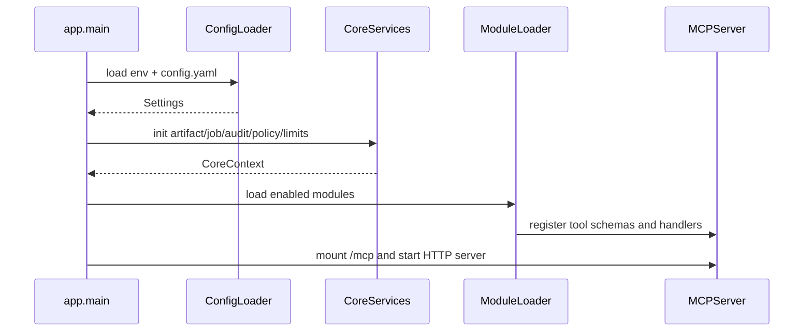
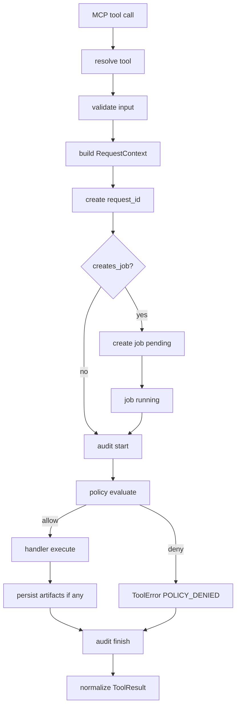

# 01. MCP Transport Detailed Design

## Entry Points And Routes

The first Gateway version exposes these HTTP routes:

| method | path | purpose | risk |
| --- | --- | --- | --- |
| `GET`/`POST` | `/mcp` | SSE MCP endpoint for ZeroClaw connections and tool calls | medium |
| `GET` | `/artifacts/{artifact_id}` | artifact download; must be authenticated or restricted to trusted local networks | medium |
| `GET` | `/healthz` | process health check; does not expose secrets or provider details | low |
| `GET` | `/readyz` | readiness check with enabled-module summary | low |

`/mcp` is the MCP protocol boundary. Business modules must not register their own HTTP routes, except for artifact download support owned by the transport/infrastructure layer.

## Recommended Components

```text
app/
  main.py
  config.py
  dependencies.py
transport/
  mcp_server.py
  artifact_routes.py
  request_context.py
tools/
  registry.py
  dispatcher.py
  result.py
  validation.py
```

Responsibilities:

- `mcp_server.py`: initialize the MCP server, SSE transport, and exposed tools.
- `artifact_routes.py`: artifact download route, permission checks, Range support, and cache headers.
- `request_context.py`: build `RequestContext` from connection metadata, headers, tokens, or network source.
- `registry.py`: module-level tool schema and handler registration.
- `dispatcher.py`: create `request_id`, validate input, evaluate policy, invoke handlers, and normalize errors.
- `result.py`: `ToolResult`, `ToolError`, and MCP response conversion.
- `validation.py`: JSON Schema or Pydantic model validation.

## Startup Flow



Startup validation rules:

- Missing required configuration fails startup with an error that does not include raw secrets.
- Providers for disabled modules are not validated.
- Required secrets for enabled modules are logged only as `present: true/false`.
- The artifact root must be readable and writable, and the SQLite database must be openable.

## Tool Registry

Use a single tool definition shape:

```text
ToolDefinition
  name: string
  title: string
  description: string
  input_schema: JSON schema
  output_schema: JSON schema | null
  risk_level: low | medium | high
  handler: async function
  creates_job: boolean
```

Registration constraints:

- Tool names are globally unique.
- Tool names use snake_case and a domain prefix.
- `input_schema` must not contain provider `base_url`, `api_key`, Matrix token, or local system paths.
- High-risk tools must declare `risk_level = high`.

## Dispatch Flow



The dispatcher must catch all exceptions and map them to stable Gateway error codes. Unknown exceptions map to `INTERNAL_ERROR`; tracebacks are logged internally but never returned in MCP responses.

## RequestContext

```text
RequestContext
  request_id: string
  caller: CallerIdentity
  config: Settings
  artifacts: ArtifactStore
  jobs: JobManager
  policy: PolicyEngine
  audit: AuditLogger
  limits: RateLimiter
  http_client: HttpClient
  now: Clock
```

Caller identity resolution order:

1. `Authorization: Bearer <gateway caller token>` mapped to a configured caller.
2. caller metadata from the MCP connection.
3. source IP or Docker network mapping.
4. fallback to `anonymous`, which can only call low-risk read-only tools by default.

## Synchronous And Asynchronous Execution

Handlers may complete synchronously in the first version, but the dispatcher supports timeout-based fallback:

- If the tool finishes within `sync_tool_timeout_seconds`, return `status = "succeeded"` or `failed`.
- If the threshold is exceeded, keep the job running and return `status = "running"` plus `job_id`.
- When the background task finishes, update the job, artifact records, and audit event.

If the selected Python MCP SDK or transport makes background progress events inconvenient, `job_status` remains the authoritative status endpoint for the MVP.

## Artifact Download

`GET /artifacts/{artifact_id}` flow:

1. Resolve caller.
2. Query artifact metadata.
3. Check existence, expiration, and caller read permission.
4. Canonicalize `storage_path` and verify it is under `ARTIFACT_ROOT`.
5. Return a file stream with these headers:

```text
Content-Type: <mime_type>
Content-Length: <size_bytes>
Content-Disposition: inline; filename="<filename>"
X-Artifact-Id: <artifact_id>
Cache-Control: private, max-age=300
```

For local-only use, the first version may return plain internal URLs. If artifacts are exposed across machines or to the public internet later, switch to signed URLs with `expires`, `signature`, and caller binding.

## Error Response

All tool failures use a stable response shape:

```json
{
  "ok": false,
  "request_id": "req_...",
  "job_id": "job_...",
  "status": "failed",
  "error": {
    "code": "PROVIDER_TIMEOUT",
    "message": "image provider timeout",
    "retryable": true
  }
}
```

`message` should be readable by the caller, but must not include tokens, Authorization headers, sensitive host paths, or raw provider stack traces.

