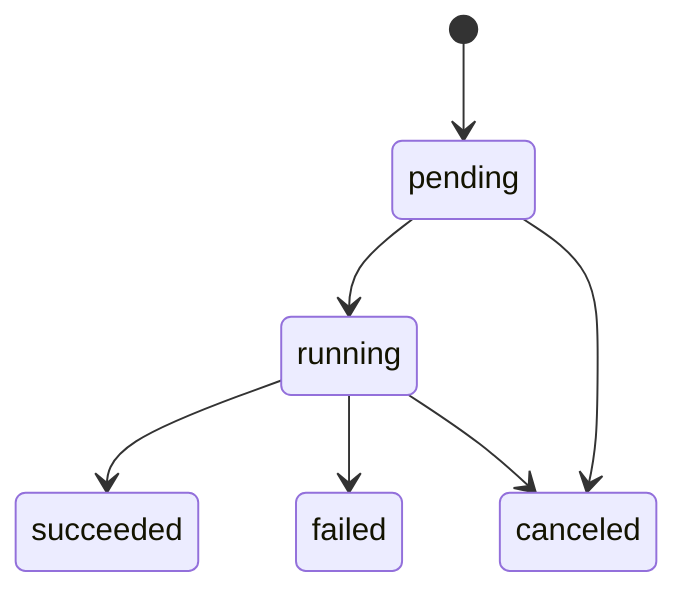

# 02. Core Schema Detailed Design

## Directory Structure

```text
mcp_1/
  app/
  transport/
  tools/
  core/
    artifacts.py
    jobs.py
    policy.py
    audit.py
    errors.py
    limits.py
    ids.py
    time.py
  modules/
    image/
    tts/
    matrix/
    printer/
  config/
    config.example.yaml
  artifacts/
```

`core/` must not depend on any capability module. Capability modules may depend on core interfaces.

## ID Format

| type | prefix | example |
| --- | --- | --- |
| request | `req_` | `req_01jz...` |
| job | `job_` | `job_01jz...` |
| artifact | `art_` | `art_01jz...` |
| audit event | `aud_` | `aud_01jz...` |

Use ULID for IDs so records are roughly sortable by creation time. Public IDs must not contain paths, caller names, or provider IDs.

## SQLite Settings

Run these pragmas on startup:

```sql
PRAGMA journal_mode = WAL;
PRAGMA foreign_keys = ON;
PRAGMA busy_timeout = 5000;
```

Migration policy:

- Use a `schema_migrations` table for the first version.
- Execute migrations in version order during startup.
- Fail startup if a migration fails, avoiding half-initialized operation.

## DDL

```sql
CREATE TABLE IF NOT EXISTS schema_migrations (
  version INTEGER PRIMARY KEY,
  name TEXT NOT NULL,
  applied_at TEXT NOT NULL
);

CREATE TABLE IF NOT EXISTS artifacts (
  id TEXT PRIMARY KEY,
  kind TEXT NOT NULL,
  mime_type TEXT NOT NULL,
  filename TEXT NOT NULL,
  storage_path TEXT NOT NULL,
  size_bytes INTEGER NOT NULL,
  sha256 TEXT NOT NULL,
  owner_caller_id TEXT NOT NULL,
  source_tool TEXT NOT NULL,
  source_job_id TEXT,
  created_at TEXT NOT NULL,
  expires_at TEXT,
  deleted_at TEXT,
  metadata_json TEXT NOT NULL DEFAULT '{}'
);

CREATE INDEX IF NOT EXISTS idx_artifacts_owner_created
  ON artifacts(owner_caller_id, created_at);

CREATE INDEX IF NOT EXISTS idx_artifacts_source_job
  ON artifacts(source_job_id);

CREATE TABLE IF NOT EXISTS jobs (
  id TEXT PRIMARY KEY,
  request_id TEXT NOT NULL,
  caller_id TEXT NOT NULL,
  tool_name TEXT NOT NULL,
  status TEXT NOT NULL,
  progress REAL NOT NULL DEFAULT 0,
  input_summary_json TEXT NOT NULL DEFAULT '{}',
  result_summary_json TEXT,
  error_code TEXT,
  error_message TEXT,
  artifact_ids_json TEXT NOT NULL DEFAULT '[]',
  created_at TEXT NOT NULL,
  started_at TEXT,
  updated_at TEXT NOT NULL,
  finished_at TEXT
);

CREATE INDEX IF NOT EXISTS idx_jobs_caller_created
  ON jobs(caller_id, created_at);

CREATE INDEX IF NOT EXISTS idx_jobs_status_updated
  ON jobs(status, updated_at);

CREATE TABLE IF NOT EXISTS audit_events (
  id TEXT PRIMARY KEY,
  request_id TEXT NOT NULL,
  job_id TEXT,
  caller_id TEXT NOT NULL,
  tool_name TEXT NOT NULL,
  risk_level TEXT NOT NULL,
  input_summary_json TEXT NOT NULL DEFAULT '{}',
  policy_decision TEXT,
  status TEXT NOT NULL,
  artifact_ids_json TEXT NOT NULL DEFAULT '[]',
  error_code TEXT,
  error_message TEXT,
  started_at TEXT NOT NULL,
  finished_at TEXT,
  duration_ms INTEGER
);

CREATE INDEX IF NOT EXISTS idx_audit_request
  ON audit_events(request_id);

CREATE INDEX IF NOT EXISTS idx_audit_caller_started
  ON audit_events(caller_id, started_at);

CREATE TABLE IF NOT EXISTS caller_artifact_grants (
  artifact_id TEXT NOT NULL,
  caller_id TEXT NOT NULL,
  permission TEXT NOT NULL,
  created_at TEXT NOT NULL,
  expires_at TEXT,
  PRIMARY KEY (artifact_id, caller_id, permission),
  FOREIGN KEY (artifact_id) REFERENCES artifacts(id)
);
```

## ArtifactStore

Interface:

```text
ArtifactStore.create_from_bytes(kind, mime_type, extension, bytes, owner, source_tool, source_job_id, metadata) -> Artifact
ArtifactStore.create_from_file(kind, mime_type, source_path, owner, source_tool, source_job_id, metadata) -> Artifact
ArtifactStore.get(artifact_id, caller) -> Artifact
ArtifactStore.open_stream(artifact_id, caller) -> FileStream
ArtifactStore.grant(artifact_id, caller_id, permission, expires_at)
ArtifactStore.expire_old(now)
```

Atomic write rules:

1. Write to `${ARTIFACT_ROOT}/tmp/{artifact_id}.part`.
2. Compute sha256 and size while writing.
3. Enforce `size_bytes <= max_artifact_bytes`.
4. Build the target directory from kind and date.
5. Move atomically within the same filesystem.
6. Insert SQLite metadata.
7. Delete the temporary file on any failure.

Directory mapping:

| kind | directory | default retention |
| --- | --- | --- |
| `image` | `images/YYYY/MM/` | 30 days |
| `audio` | `audio/YYYY/MM/` | 30 days |
| `document` | `documents/YYYY/MM/` | 30 days |
| `print` | `print/YYYY/MM/` | 7 days |
| `temp` | `tmp/` | 24 hours |

## JobManager

Interface:

```text
JobManager.create(request_id, caller_id, tool_name, input_summary) -> Job
JobManager.mark_running(job_id)
JobManager.update_progress(job_id, progress, result_summary?)
JobManager.mark_succeeded(job_id, result_summary, artifact_ids)
JobManager.mark_failed(job_id, error_code, error_message)
JobManager.get(job_id, caller) -> Job
```

State machine:



Constraints:

- `progress` must be between `0.0` and `1.0`.
- `succeeded`, `failed`, and `canceled` are terminal states.
- Normal callers can read only their own jobs; admin callers can read all jobs.

## AuditLogger

Audit events are written in two steps:

1. `audit_start`: request, caller, tool, risk level, and redacted input summary.
2. `audit_finish`: policy decision, status, artifacts, error code, and duration.

Input summary redaction:

- prompt/text/caption: keep the first 200 characters and the original length.
- room_id, printer_id, and artifact_id may be recorded as-is.
- Authorization headers, access tokens, and API keys are never recorded.
- Provider original URLs are logged as host plus response type by default; full URLs require explicit debug configuration.

## Error Model

```text
GatewayError
  code: string
  message: string
  retryable: boolean
  details: object | null
```

Stable error codes:

`INVALID_ARGUMENT`, `AUTH_REQUIRED`, `POLICY_DENIED`, `RATE_LIMITED`, `ARTIFACT_NOT_FOUND`, `ARTIFACT_FORBIDDEN`, `PROVIDER_UNAVAILABLE`, `PROVIDER_REJECTED`, `PROVIDER_TIMEOUT`, `UNSUPPORTED_MEDIA_TYPE`, `INTERNAL_ERROR`.

## Configuration Loading

Loading order:

1. `config.example.yaml` provides the documented structure, not production secrets.
2. `CONFIG_PATH` points to the actual `config.yaml`.
3. Environment variables replace `${VAR}` placeholders.
4. Startup validation creates typed settings.

Settings are read-only during runtime. The first version reloads policy/configuration by restarting the Gateway.

