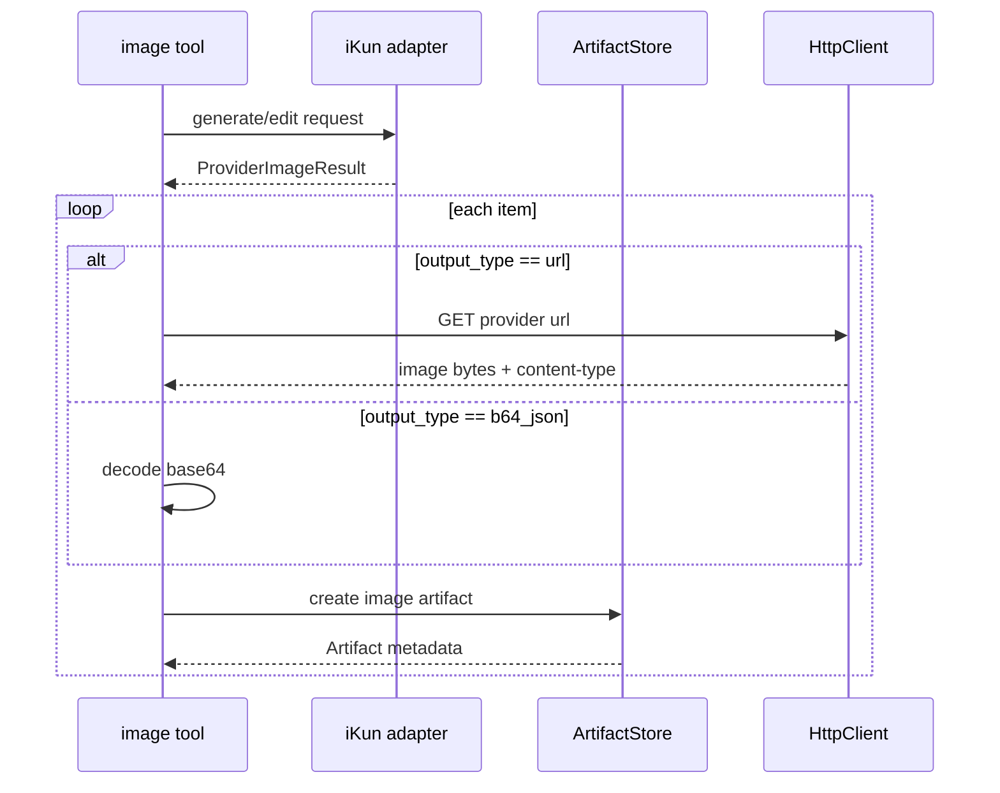

# 03. Image Provider Detailed Design

## Objective

The first image module supports:

- `image_generate`: text-to-image.
- `image_edit`: image editing or image-to-image based on one or more image artifacts.
- provider: `ikun_openai_compatible`.
- response normalization for both `data[].url` and `data[].b64_json`.
- local persistence of every output image as an image artifact.

## Tool Inputs

`image_generate`:

```json
{
  "prompt": "string",
  "size": "auto | 1024x1024 | 1536x1024 | 1024x1536 | 3840x2160 | 2160x3840",
  "quality": "low | medium | high | auto",
  "output_format": "png | jpeg | webp",
  "n": 1
}
```

`image_edit`:

```json
{
  "image_artifact_ids": ["art_..."],
  "prompt": "string",
  "size": "auto | 1024x1024 | 1536x1024 | 1024x1536 | 3840x2160 | 2160x3840",
  "quality": "low | medium | high | auto",
  "output_format": "png | jpeg | webp"
}
```

Single-image compatibility input:

```json
{
  "image_artifact_id": "art_...",
  "prompt": "string"
}
```

Tool-level validation:

- `prompt` is required and defaults to a 4000-character maximum.
- `n` is fixed to 1 for the first version.
- `size` must be in the configured allowlist. `auto` maps to the configured default size or a provider-supported value.
- `quality` and `output_format` must be enum values.
- `image_edit` accepts only artifacts in the first version, not URLs or local paths.
- Input image MIME must be `image/png`, `image/jpeg`, or `image/webp`.
- Default per-image input limit is 10 MiB; total input image limit is 30 MiB.

## Provider Configuration

```yaml
modules:
  image:
    enabled: true
    provider: ikun_openai_compatible
    base_url: ${IMAGE_API_BASE_URL}
    api_key: ${IMAGE_API_KEY}
    model: ${IMAGE_API_MODEL}
    request_timeout_seconds: 180
    max_concurrent: 2
    max_input_image_bytes: 10485760
    max_input_images: 5
    allowed_sizes:
      - "1024x1024"
      - "1536x1024"
      - "1024x1536"
      - "3840x2160"
      - "2160x3840"
    default_size: "1024x1024"
    default_quality: "auto"
    default_output_format: "png"
    moderation: "auto"
    response_mode: "auto"
```

Recommended environment variables:

```text
IMAGE_API_BASE_URL=https://api.example.com
IMAGE_API_MODEL=gpt-image-2
IMAGE_API_KEY=<secret>
```

## Text-To-Image Request

HTTP:

```text
POST {base_url}/v1/images/generations
Authorization: Bearer <api_key>
Content-Type: application/json
```

Request body:

```json
{
  "model": "gpt-image-2",
  "prompt": "Learn from Lei Feng",
  "n": 1,
  "size": "3840x2160",
  "quality": "auto",
  "output_format": "png"
}
```

Field mapping:

| Gateway input | Provider field | notes |
| --- | --- | --- |
| `prompt` | `prompt` | pass through unchanged; do not append "8K" or similar enhancer terms |
| `size` | `size` | map `auto` to the default size first |
| `quality` | `quality` | default `auto` |
| `output_format` | `output_format` | default `png` |
| `n` | `n` | fixed to 1 for the MVP |
| configured `model` | `model` | cannot be overridden by tool input |

## Image Edit Request

HTTP:

```text
POST {base_url}/v1/images/edits
Authorization: Bearer <api_key>
Content-Type: multipart/form-data
```

Multipart fields:

```text
model=gpt-image-2
prompt=<prompt>
size=<allowed size>
output_format=png
moderation=auto
quality=auto
image[]=@<artifact file 1>
image[]=@<artifact file 2>
```

The iKun sample includes `stream=true` and `partial_images=1`. Do not expose these provider-private parameters in the MCP tool schema for the first version. If experimentation is needed, enable them only through provider configuration; default is off.

## Response Normalization

The provider may return a URL response:

```json
{
  "created": 1779552057,
  "data": [
    {
      "id": "compat-generate-1779552057963035009-0",
      "revised_prompt": "...",
      "source_account_id": "...",
      "url": "image URL here"
    }
  ],
  "usage": {
    "total_tokens": 10
  }
}
```

Or a base64 response:

```json
{
  "created": 1779758035,
  "data": [
    {
      "b64_json": "base64 payload here",
      "revised_prompt": "..."
    }
  ],
  "background": "auto",
  "output_format": "png",
  "quality": "auto",
  "size": "3840x2160",
  "model": "gpt-image-2",
  "usage": {
    "total_tokens": 3406
  }
}
```

Adapter output:

```text
ProviderImageResult
  provider_name: ikun_openai_compatible
  model: string
  created: integer | null
  items:
    - provider_item_id: string | null
      revised_prompt: string | null
      output_type: url | b64_json
      url: string | null
      b64_json: string | null
      mime_hint: string | null
  usage: object
  raw_metadata_summary: object
```

Normalization rules:

- `data` must be a non-empty array.
- Every item must contain either `url` or `b64_json`.
- If `output_format` is missing, use the requested output format.
- Missing provider `id` is allowed; the Gateway artifact ID is the durable identifier.
- `source_account_id` is not returned in normal tool responses. It may be stored only in redacted metadata.
- `usage` may be stored in artifact metadata and job result summary.

## Persistence Flow



URL download rules:

- The local iKun reference states that image product links are valid for about 30 minutes; the Gateway must download them immediately.
- Allow only `https://` and configured provider hosts unless `allow_http_provider_urls` is explicitly enabled.
- Default download timeout is 60 seconds.
- Downloaded MIME must be in the image allowlist.
- Downloaded size must be limited by `max_artifact_bytes`.
- The original provider URL is stored only in metadata and is redacted in logs by default.

Base64 decode rules:

- Estimate decoded size from string length before decoding; reject if it exceeds the limit.
- Enforce the actual byte limit after decoding.
- Infer MIME from `output_format`; normalize `jpg` to `image/jpeg`.

## Tool Output

Single-image success:

```json
{
  "ok": true,
  "request_id": "req_...",
  "job_id": "job_...",
  "status": "succeeded",
  "artifact": {
    "id": "art_...",
    "kind": "image",
    "mime_type": "image/png",
    "filename": "art_....png",
    "url": "http://127.0.0.1:8787/artifacts/art_...",
    "size_bytes": 123456,
    "metadata": {
      "provider": "ikun_openai_compatible",
      "model": "gpt-image-2",
      "size": "3840x2160",
      "quality": "auto",
      "provider_output": "url"
    }
  },
  "image": {
    "revised_prompt": "...",
    "provider_item_id": "compat-generate-...",
    "provider_output": "url"
  }
}
```

The first version may support multiple internal outputs through an `artifacts` array. If the public tool contract declares a single image, return the first artifact as `artifact` and record `metadata.total_outputs`.

## Error Mapping

| condition | Gateway error code | retryable |
| --- | --- | --- |
| empty prompt or size outside allowlist | `INVALID_ARGUMENT` | false |
| artifact missing or forbidden | `ARTIFACT_NOT_FOUND` / `ARTIFACT_FORBIDDEN` | false |
| provider 401/403 | `PROVIDER_REJECTED` | false |
| provider 429 | `RATE_LIMITED` | true |
| provider 5xx | `PROVIDER_UNAVAILABLE` | true |
| provider timeout | `PROVIDER_TIMEOUT` | true |
| provider response is not JSON | `PROVIDER_UNAVAILABLE` | true |
| response lacks both `url` and `b64_json` | `PROVIDER_UNAVAILABLE` | true |
| provider URL download failure | `PROVIDER_UNAVAILABLE` or `PROVIDER_TIMEOUT` | true |
| unsupported image MIME | `UNSUPPORTED_MEDIA_TYPE` | false |

Automatic retry applies only to network timeout and 5xx responses, with a default maximum of one retry. Do not automatically retry content violations, invalid dimensions, or token errors.

## iKun Integration Notes

The local iKun reference states:

- Image product URLs are valid for about 30 minutes.
- URL responses expire; base64 responses do not depend on remote URLs but use more bandwidth.
- Different token groups may return URL or base64.
- Some URL groups may downgrade from 4K to 2K when 4K generation fails.
- Common failure causes include token errors, unavailable upstream accounts, prompt policy violations, non-standard dimensions, infringement-related content, and unsuitable quality enhancer words in the prompt.

Gateway handling:

- Use `response_mode = auto` and detect the actual response field.
- Accept only configured allowlist sizes.
- Do not automatically append quality enhancer terms to prompts.
- Store actual provider `size`, `quality`, and `output_format` in metadata.
- If actual output size differs from requested size, the tool may still succeed, but metadata must set `provider_size_mismatch = true`.

