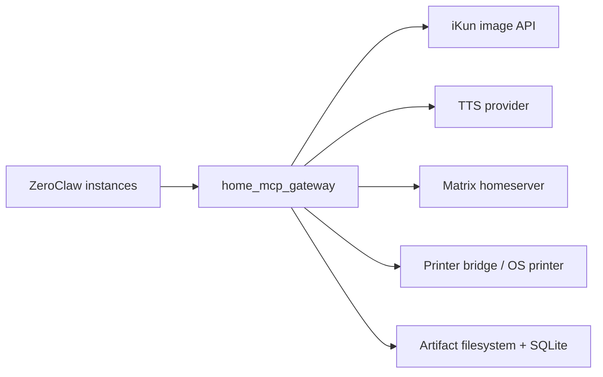

# 04. Security Policy Detailed Design

## Trust Boundary



Principles:

- ZeroClaw instances do not hold third-party secrets.
- The Gateway is the only side-effect execution boundary.
- Tool schemas do not expose provider URLs, secrets, or local system paths.
- High-risk actions are checked again inside the Gateway and do not rely on ZeroClaw auto approval.

## Caller Identity

Configuration shape:

```yaml
callers:
  host_assistant:
    role: admin
    token_env: GATEWAY_TOKEN_HOST
    shared_artifact_read: true
  role_alice:
    role: role_play
    token_env: GATEWAY_TOKEN_ROLE_ALICE
    shared_artifact_read: false
```

Resolution order:

1. Bearer token mapped to a configured caller.
2. MCP connection metadata mapped to a caller.
3. source IP or Docker network mapped to a caller.
4. fallback to `anonymous`.

`anonymous` can call only `health_check` by default and cannot read artifacts.

## PolicyInput

```text
PolicyInput
  request_id
  caller_id
  caller_role
  tool_name
  risk_level
  arguments_summary
  artifact_ids
  target_room_id
  target_printer_id
  estimated_cost_units
  now
```

PolicyDecision:

```text
PolicyDecision
  action: allow | deny | require_approval
  reason: string
  matched_rules: string[]
```

The first version does not provide a standalone approval UI. `require_approval` maps to `POLICY_DENIED` with a message explaining that Gateway configuration or ZeroClaw-side confirmation is required.

## Default Policy

| tool | default policy | key checks |
| --- | --- | --- |
| `health_check` | allow | allowed when provider details are omitted |
| `job_status` | allow own/admin | caller can read only its own jobs |
| `artifact_get` | allow own/admin/grant | artifact permission and expiration |
| `image_generate` | allow with limits | prompt length, size, budget, concurrency |
| `image_edit` | allow with limits | input artifact permission, MIME, size, budget |
| `tts_synthesize` | allow with limits | text length, voice allowlist, concurrency |
| `matrix_send_text` | deny unless allowlisted | room allowlist, text length, frequency |
| `matrix_send_audio` | deny unless allowlisted | room allowlist, artifact permission, MIME |
| `printer_list` | allow | return only allowlisted printers |
| `printer_print_file` | deny unless allowlisted | printer allowlist, MIME, copies, size |

## Rate Limits

Use an in-process limiter for the first version. Move to Redis only when multi-instance deployment is required.

Limit dimensions:

```yaml
limits:
  max_image_jobs_global: 2
  max_image_jobs_per_caller: 1
  image_jobs_per_caller_per_day: 20
  max_tts_jobs_global: 2
  matrix_messages_per_room_per_minute: 5
  max_print_jobs_global: 1
```

When a rate limit is hit, return `RATE_LIMITED` with `retryable = true`.

## Artifact Permissions

Read access is allowed when:

- the caller owns the artifact.
- the caller role is `admin` and `shared_artifact_read = true`.
- an unexpired `caller_artifact_grants` record exists.

Matrix sending and printing still require target room/printer policy checks even when the caller can read the artifact.

## Path Safety

Forbidden:

- arbitrary absolute paths in tool input.
- `../`, UNC paths, Windows drive paths, and symlink escapes.
- returning provider URLs as durable artifact URLs.

File access rules:

1. All storage paths are generated by ArtifactStore.
2. Canonicalize before opening.
3. Verify the canonical path is under canonical `ARTIFACT_ROOT`.
4. Reject symlinks that resolve outside the root.

## Secret Management

Secrets come only from environment variables or a local secret store. Config files contain `${VAR}` placeholders only.

Never log:

- `IMAGE_API_KEY`
- `MATRIX_ACCESS_TOKEN`
- Authorization headers
- caller tokens
- contents of `dev_documents/ikun/key.txt`

Startup logs may record only:

```json
{
  "secret": "IMAGE_API_KEY",
  "present": true
}
```

## Provider Network Safety

iKun provider:

- `base_url` comes from configuration.
- tool calls cannot override `base_url`.
- image download URLs must come from provider responses.
- HTTPS is required by default.
- response size and MIME are limited.

If a provider image URL host is not in the allowlist, reject persistence and return `PROVIDER_UNAVAILABLE`.

## Matrix Safety

Configuration:

```yaml
policy:
  allowed_matrix_rooms:
    - "!example:matrix.org"
```

Rules:

- room must match the allowlist.
- text and caption lengths are limited.
- audio artifact MIME must be `audio/ogg`, `audio/mpeg`, or `audio/wav`.
- Matrix result returns only `event_id`, `room_id`, and media summary.

## Printing Safety

Configuration:

```yaml
policy:
  allowed_printers:
    - "Home_Printer"
  printable_mime_types:
    - application/pdf
    - image/png
    - image/jpeg
```

Rules:

- print only artifacts.
- `copies` defaults to 1 and defaults to a maximum of 3.
- printer id must match the allowlist.
- file size defaults to a 50 MiB maximum.
- every print action must create a job and audit event.

## Logging And Retention

Log types:

- application log: JSON to stdout.
- audit log: SQLite `audit_events`.
- provider debug log: disabled by default.

Retention:

- audit records default to 90 days.
- application logs are rotated by Docker or the host logging system.
- artifact expiration must not delete audit summaries.

## Network Exposure

Recommended first-version exposure:

- bind to `127.0.0.1:8787` for single-machine debugging.
- bind to `0.0.0.0:8787` for Docker sharing, but restrict source networks with the host firewall.
- do not expose directly to the public internet.

Before public or cross-machine deployment, add:

- TLS.
- Gateway bearer token or mTLS.
- signed artifact URLs.
- IP allowlist.
- stronger caller identity.

