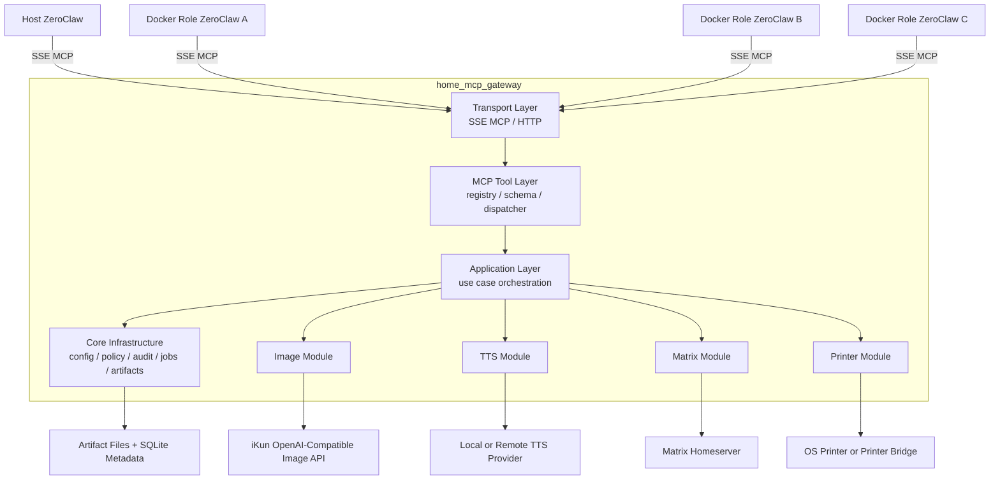

# 01. Overall Architecture

## Architecture View



## Layer Responsibilities

### Transport Layer

Handles MCP over SSE connections, request parsing, response writing, progress event delivery, and HTTP routes for artifact downloads. This layer does not contain business rules and does not call providers directly.

### MCP Tool Layer

Handles tool registration, tool schema exposure, argument validation, common error conversion, and dispatch. This is the external contract boundary visible to ZeroClaw.

### Application Layer

Orchestrates use cases such as creating jobs, checking policies, calling capability services, writing artifacts, and recording audit logs. Cross-module flows are coordinated here; capability modules do not import each other directly.

### Capability Module Layer

Owns domain-specific capabilities. Version 1 includes:

- `image`: text-to-image and image edit/image-to-image.
- `tts`: text-to-speech.
- `matrix`: text, audio, and optional image sending.
- `printer`: printer listing and artifact printing.

### Provider Adapter Layer

Adapts third-party APIs, local services, or operating-system capabilities. Provider adapters expose stable module-level service interfaces and do not leak provider response formats into MCP tool contracts.

### Infrastructure Layer

Owns configuration, secret access, artifact storage, job management, policy evaluation, audit logging, HTTP clients, rate limits, and the shared error model.

## Key Design Decisions

| ID | Decision | Rationale |
| --- | --- | --- |
| HD-001 | Use a modular monolithic Gateway for version 1 | Reduces deployment complexity and centralizes secrets, audit, and policy |
| HD-002 | Expose SSE MCP at `/mcp` | ZeroClaw supports SSE; SSE fits long-running tasks and progress events |
| HD-003 | Store artifact metadata in SQLite and artifact bytes on the local filesystem | Easier query and recovery than raw files only, lighter than object storage |
| HD-004 | Access image APIs through an OpenAI-compatible adapter | iKun uses `/v1/images/generations` and `/v1/images/edits`; future providers can be swapped |
| HD-005 | Persist provider URL and base64 responses immediately | iKun URL outputs expire; local persistence makes artifacts recoverable |
| HD-006 | Route high-risk actions through one policy engine | Keeps Matrix, printing, and other side effects from scattering policy checks across modules |

## Recommended Technology Stack

Version 1 should use Python 3.11+ with FastAPI or Starlette for HTTP and SSE. Reasons:

- Fast implementation of SSE, multipart requests, provider HTTP clients, file serving, and Docker deployment.
- Good compatibility with TTS, printing, and local scripting ecosystems.
- The design remains language-neutral. If Rust is chosen later, the same layering and contracts still apply.

## Directory Structure

```text
mcp_1/
  app/
    main.py
    config.py
    logging.py
  transport/
    sse_server.py
    artifact_routes.py
  tools/
    registry.py
    schemas.py
    dispatcher.py
  core/
    artifacts.py
    jobs.py
    policy.py
    audit.py
    errors.py
    limits.py
  modules/
    image/
      manifest.py
      service.py
      schemas.py
      providers/
        ikun_openai_compatible.py
    tts/
      manifest.py
      service.py
      schemas.py
      providers/
        local_http.py
    matrix/
      manifest.py
      service.py
      schemas.py
      providers/
        matrix_client.py
    printer/
      manifest.py
      service.py
      schemas.py
      providers/
        bridge_http.py
        os_print.py
  deploy/
    Dockerfile
    docker-compose.yml
  config/
    config.example.yaml
  artifacts/
```

## Module Assembly

Each capability module exposes a manifest:

```text
ModuleManifest
  name
  version
  enabled
  tools
  required_config
  required_secrets
  risk_level

register_tools(registry)
health_check(context)
```

At startup, the module loader reads configuration, loads enabled modules, and calls `register_tools`. Adding a new module must not require changes to the transport layer.
