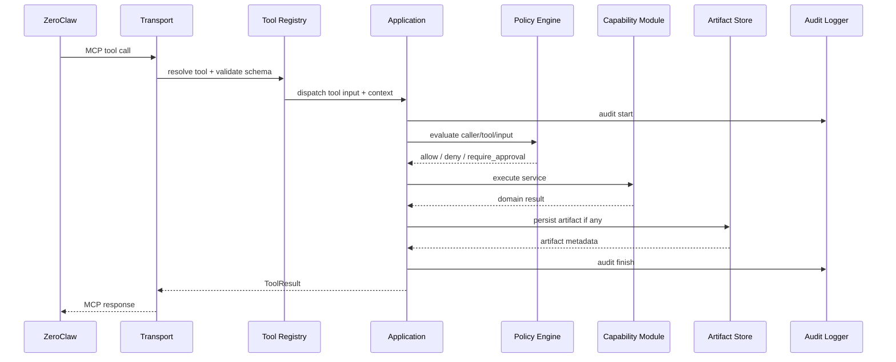
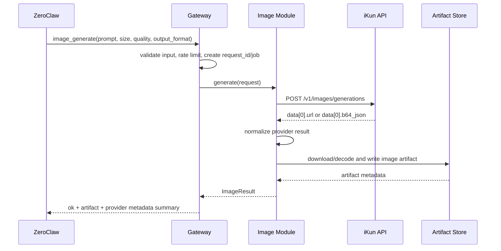
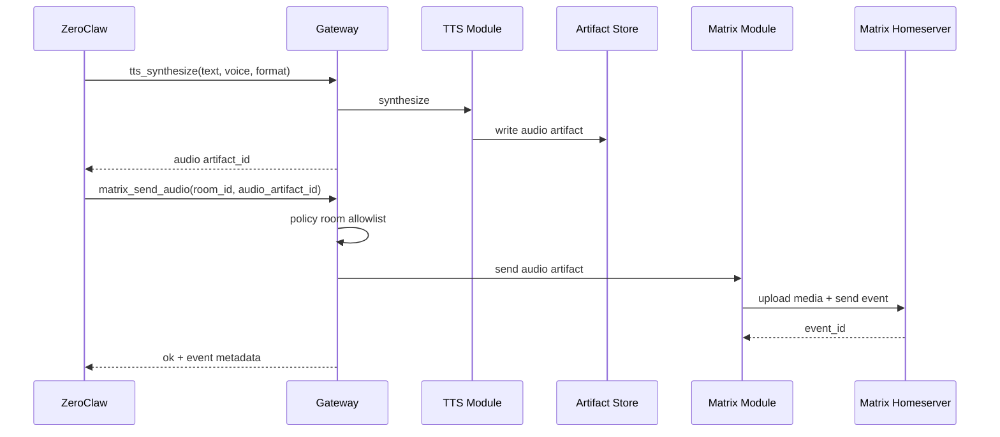

# 02. Runtime and Call Sequences

## Startup Flow

1. Read environment variables and `config.yaml`.
2. Validate required configuration and secrets without logging secret values.
3. Initialize the artifact store, create directories, and open the SQLite metadata database.
4. Initialize the audit logger, policy engine, rate limiter, and job manager.
5. Load enabled modules and register MCP tools.
6. Start the SSE MCP endpoint `/mcp` and artifact download endpoint `/artifacts/{artifact_id}`.
7. Run provider health checks. Provider health is recorded but does not block disabled modules.

## ZeroClaw Connection

ZeroClaw registers this service through `[[mcp.servers]]` in `config.toml`. Based on the ZeroClaw MCP reference, `name` becomes the tool prefix. Recommended host configuration:

```toml
[[mcp.servers]]
name = "home"
transport = "sse"
url = "http://127.0.0.1:8787/mcp"
deferred_loading = true
```

Docker ZeroClaw connecting to a host Gateway:

```toml
[[mcp.servers]]
name = "home"
transport = "sse"
url = "http://host.docker.internal:8787/mcp"
deferred_loading = true
```

Docker ZeroClaw and Gateway in the same compose network:

```toml
[[mcp.servers]]
name = "home"
transport = "sse"
url = "http://home-mcp:8787/mcp"
deferred_loading = true
```

Keep `deferred_loading = true` to reduce initial tool schema token overhead.

## Generic Tool Call Flow



## Text-to-Image Sequence



Design requirements:

- `IMAGE_API_BASE_URL` comes only from configuration. Tool calls cannot pass arbitrary provider URLs.
- If iKun returns a URL, the Gateway downloads it immediately. The original URL is stored only as metadata and is not used as the long-term artifact URL.
- If iKun returns `b64_json`, the Gateway decodes it and writes a local file.
- If the provider returns multiple `data` items, version 1 should save all of them and return an artifact list. If the tool contract is limited to one image, return the first artifact and record the total count in metadata.

## Image Edit Sequence

`image_edit` first reads the input image from the artifact store, validates MIME type, size, and caller permission, then calls the provider with multipart/form-data. The iKun reference endpoint is:

- `POST /v1/images/edits`
- form fields: `model`, `prompt`, `size`, `output_format`, `quality`, `moderation`
- file field: `image[]`

Version 1 tool input accepts only `image_artifact_id` or `image_artifact_ids`. It does not accept arbitrary local paths.

## TTS to Matrix Audio Sequence



TTS and Matrix do not call each other directly. Composition is done by ZeroClaw or the Application layer.

## Sync and Async Strategy

Version 1 tools may be implemented as synchronous MCP tools, but the Gateway should create an internal job record for every potentially long-running or side-effecting operation:

- If the call finishes within `SYNC_TOOL_TIMEOUT_SECONDS`, the response returns the final result.
- If the timeout threshold is exceeded, the response returns `job_id` and `status = "running"`, and the caller can query `job_status`.
- SSE may emit progress events. If ZeroClaw does not consume progress events, `job_status` remains the authoritative state.

## Health Check

Provide a low-risk `health_check` tool:

```json
{
  "include_providers": false
}
```

Response:

```json
{
  "ok": true,
  "request_id": "req_...",
  "server": {
    "name": "home_mcp_gateway",
    "version": "0.1.0"
  },
  "modules": {
    "image": "enabled",
    "tts": "enabled",
    "matrix": "enabled",
    "printer": "disabled"
  }
}
```
