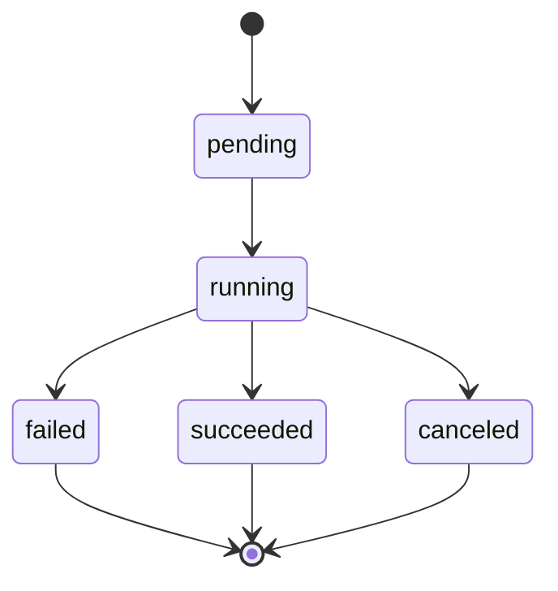

# 04. Artifact and Job Design

## Artifact Goals

The artifact store saves all file outputs, including images, audio, printable documents, and temporary intermediate files. MCP tools do not return binary payloads directly; they return artifact metadata.

## Storage Shape

Version 1 uses:

- File bytes: local filesystem, rooted at `ARTIFACT_ROOT`.
- Metadata: SQLite, with the database stored at `${ARTIFACT_ROOT}/metadata.sqlite3`.
- Access URL: Gateway route `GET /artifacts/{artifact_id}`.

Directory layout:

```text
artifacts/
  metadata.sqlite3
  images/
    2026/
      06/
        art_....png
  audio/
    2026/
      06/
        art_....ogg
  print/
  tmp/
```

## Artifact Data Model

```text
Artifact
  id: string
  kind: image | audio | document | print | temp
  mime_type: string
  filename: string
  storage_path: string
  size_bytes: integer
  sha256: string
  owner_caller_id: string
  source_tool: string
  source_job_id: string
  created_at: datetime
  expires_at: datetime | null
  metadata_json: object
```

`metadata_json` example:

```json
{
  "provider": "ikun_openai_compatible",
  "provider_item_id": "compat-generate-...",
  "provider_output": "url",
  "provider_original_url": "https://...",
  "provider_original_url_expires_hint_minutes": 30,
  "model": "gpt-image-2",
  "size": "3840x2160",
  "quality": "auto",
  "revised_prompt": "..."
}
```

## Artifact Permissions

Version 1 permission model:

- The caller that creates an artifact can read it by default.
- The host main ZeroClaw can be configured as an `admin` caller and may read all artifacts.
- Role-play ZeroClaw instances can read only artifacts they created, unless a policy explicitly grants shared access.
- Printing and Matrix sending still perform a second policy check when reading artifacts.

## Artifact Lifecycle

| Stage | Behavior |
| --- | --- |
| created | Write temporary file and calculate sha256 |
| committed | Atomically move to the target directory and write SQLite metadata |
| available | Readable through `artifact_get` and the download URL |
| expired | Hidden from normal callers after retention expires |
| deleted | Remove file and metadata while retaining audit summary |

Retention policy:

- Images and audio default to 30 days.
- `tmp` defaults to 24 hours.
- Print intermediate files default to 7 days.
- Audit log retention is configured separately.

## Provider Temporary URL Handling

The iKun reference says URL outputs are valid for about 30 minutes. Therefore:

- The Gateway must download `data[0].url` immediately after receiving it.
- If download fails, the tool returns `PROVIDER_UNAVAILABLE` or `PROVIDER_TIMEOUT`, and the job is marked failed.
- The local artifact URL does not inherit the provider URL expiration.
- The original provider URL is stored only as metadata and may be redacted in logs.

## Base64 Handling

Some iKun token groups return `data[0].b64_json`. Handling rules:

- Infer MIME type from `output_format`.
- Check the base64 string length before decoding to avoid excessive memory use.
- After decoding, check the actual size. If it exceeds `MAX_ARTIFACT_BYTES`, reject it and delete the temporary file.

## Job Goals

The job manager provides a unified status record for all long-running or side-effecting tools. Even if version 1 tools return synchronously, a job record should be written to support audit, recovery, and future async execution.

## Job Data Model

```text
Job
  id: string
  request_id: string
  caller_id: string
  tool_name: string
  status: pending | running | succeeded | failed | canceled
  progress: number
  input_summary_json: object
  result_summary_json: object | null
  error_code: string | null
  error_message: string | null
  artifact_ids_json: array
  created_at: datetime
  started_at: datetime | null
  updated_at: datetime
  finished_at: datetime | null
```

## Job State Machine



## Request ID and Job ID

- `request_id` identifies one MCP tool call and is used for log correlation.
- `job_id` identifies a queryable business task.
- Synchronous tools also create jobs. Simple query tools may skip job creation but still require `request_id`.

## Concurrency and Rate Limits

Recommended version 1 dimensions:

- Global concurrent image jobs.
- Concurrent image jobs per caller.
- Daily image job count or budget.
- TTS concurrency.
- Matrix sends per room per minute.
- Concurrent print jobs.
