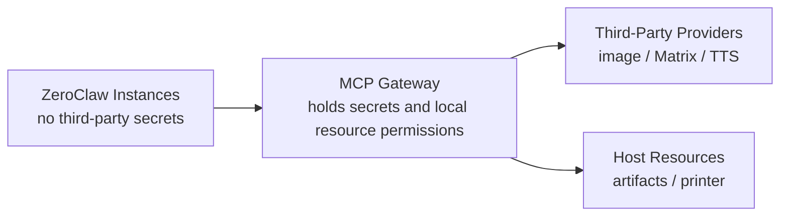

# 06. Security, Permissions, Audit, and Deployment

## Trust Boundary



Core principles:

- ZeroClaw containers do not directly hold `IMAGE_API_KEY`, `MATRIX_ACCESS_TOKEN`, or printer system permissions.
- The Gateway is the only secret holder and side-effect execution boundary.
- All high-risk actions are checked again by the Gateway, even if ZeroClaw auto approval is enabled.

## Caller Identity

Version 1 should map callers through MCP connection metadata or configured tokens:

```yaml
callers:
  host_assistant:
    role: admin
    shared_artifact_read: true
  role_alice:
    role: role_play
    shared_artifact_read: false
  role_bob:
    role: role_play
    shared_artifact_read: false
```

If version 1 cannot receive a stable identity from ZeroClaw, it should at least identify callers by connection source or server token and mark this as a detailed-design risk.

## Policy Engine

Policy input:

```text
PolicyInput
  caller_id
  tool_name
  risk_level
  arguments_summary
  artifact_ids
  target_room_id
  target_printer_id
```

Policy output:

```text
allow | deny | require_approval
reason
```

Version 1 does not implement a standalone human approval UI. `require_approval` can be mapped to `POLICY_DENIED` with an error message explaining that confirmation is required in ZeroClaw or configuration.

## Risk Policy

| Risk | Tools | Gateway Default Policy |
| --- | --- | --- |
| Low | `health_check`, `job_status`, `printer_list` | Allow |
| Low to medium | `artifact_get`, `tts_synthesize` | Check caller permission and input limits |
| Medium | `image_generate`, `image_edit` | Check budget, rate, size, and prompt length |
| High | `matrix_send_text`, `matrix_send_audio` | Room allowlist; no default auto approval |
| High | `printer_print_file` | Printer allowlist, file type, and copy count limits |

Recommended ZeroClaw `auto_approve`:

```toml
[risk_profiles.assistant]
auto_approve = [
  "home__health_check",
  "home__job_status",
  "home__artifact_get",
  "home__printer_list"
]
```

`home__tts_synthesize` may be added for private local use. `home__image_generate` and `home__image_edit` should be considered only after budget limits are configured. Matrix and printing tools should not be added by default.

## Input Security

- Tool arguments cannot pass arbitrary provider base URLs.
- Version 1 tool arguments cannot pass arbitrary local absolute paths.
- Artifact IDs must pass permission checks.
- `prompt`, `text`, and `caption` all have maximum lengths.
- Matrix rooms, printers, and printable MIME types use allowlists.
- All paths must be canonicalized and confirmed to be under `ARTIFACT_ROOT` or an allowlisted directory.

## Secret Management

Recommended environment variables:

```text
IMAGE_API_BASE_URL
IMAGE_API_KEY
IMAGE_API_MODEL
MATRIX_HOMESERVER
MATRIX_ACCESS_TOKEN
MATRIX_USER_ID
```

Rules:

- `dev_documents/ikun/key.txt` is a local reference only and must not be copied into design documents, sample configuration, or logs.
- Startup logs record only whether a secret is present, not its value.
- Audit logs must never record Authorization headers, access tokens, or complete provider URL queries.

## Audit Log

Each tool call records:

```json
{
  "request_id": "req_...",
  "job_id": "job_...",
  "caller_id": "role_alice",
  "tool_name": "image_generate",
  "risk_level": "medium",
  "input_summary": {},
  "policy_decision": "allow",
  "status": "succeeded",
  "artifact_ids": ["art_..."],
  "error_code": null,
  "started_at": "2026-06-10T00:00:00Z",
  "finished_at": "2026-06-10T00:00:12Z",
  "duration_ms": 12000
}
```

Log sinks:

- Structured JSON to stdout for Docker logs.
- SQLite or rolling file for audit records.
- Argument summaries must be redacted and truncated.

## Docker Compose

```yaml
services:
  home-mcp:
    build: .
    container_name: home-mcp
    ports:
      - "8787:8787"
    environment:
      MCP_HOST: "0.0.0.0"
      MCP_PORT: "8787"
      MCP_TRANSPORT: "sse"
      ARTIFACT_ROOT: "/artifacts"
      CONFIG_PATH: "/config/config.yaml"
      IMAGE_API_BASE_URL: "${IMAGE_API_BASE_URL}"
      IMAGE_API_KEY: "${IMAGE_API_KEY}"
      IMAGE_API_MODEL: "${IMAGE_API_MODEL}"
      MATRIX_HOMESERVER: "${MATRIX_HOMESERVER}"
      MATRIX_ACCESS_TOKEN: "${MATRIX_ACCESS_TOKEN}"
      MATRIX_USER_ID: "${MATRIX_USER_ID}"
    volumes:
      - ./artifacts:/artifacts
      - ./config:/config:ro
    restart: unless-stopped
```

For Linux Docker access to host services:

```yaml
extra_hosts:
  - "host.docker.internal:host-gateway"
```

## Example Configuration

```yaml
server:
  host: 0.0.0.0
  port: 8787
  mcp_path: /mcp
  artifact_path: /artifacts

artifacts:
  root: /artifacts
  public_base_url: http://127.0.0.1:8787/artifacts
  retention_days: 30
  max_artifact_bytes: 52428800

limits:
  sync_tool_timeout_seconds: 120
  image_prompt_max_chars: 4000
  tts_text_max_chars: 2000
  matrix_text_max_chars: 4000
  max_image_jobs_global: 2
  max_image_jobs_per_caller: 1

policy:
  default_allow: false
  allowed_matrix_rooms: []
  allowed_printers: []
  printable_mime_types:
    - application/pdf
    - image/png
    - image/jpeg

modules:
  image:
    enabled: true
    provider: ikun_openai_compatible
    base_url: ${IMAGE_API_BASE_URL}
    model: ${IMAGE_API_MODEL}
  tts:
    enabled: false
    provider: local_http
    endpoint: http://tts:5000
  matrix:
    enabled: false
  printer:
    enabled: false
```

## Network Exposure

Version 1 recommendation:

- Use `127.0.0.1:8787` for single-host debugging.
- Docker sharing may bind `0.0.0.0:8787`, but local firewall rules should limit access.
- Do not expose the Gateway directly to the public internet.

If future remote or cross-machine access is needed, add:

- TLS.
- Gateway-level bearer token or mTLS.
- IP allowlist.
- Signed artifact URLs.
- Stronger caller identity.
